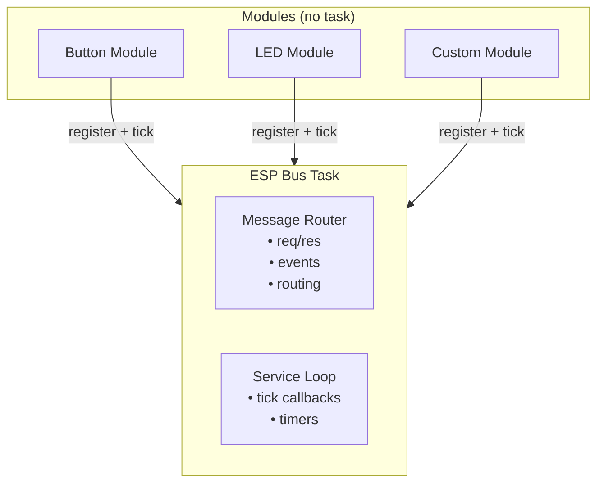
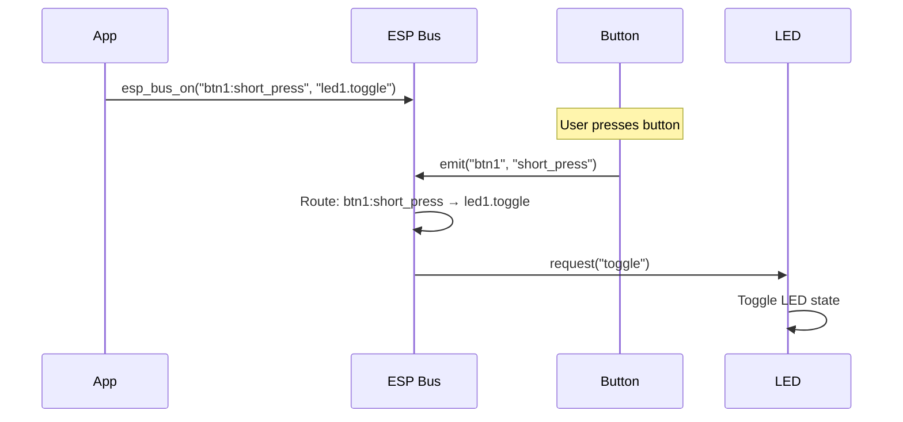
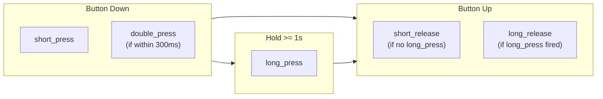
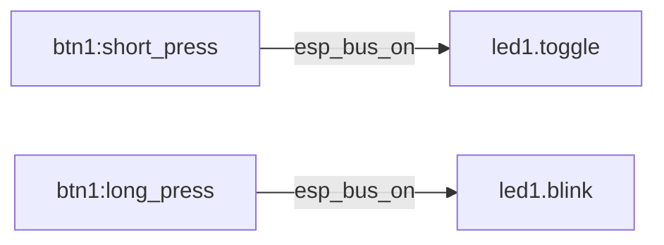

# ESP Bus

[](https://components.espressif.com/components/tuanpmt/esp_bus)

Lightweight event-driven message bus for ESP-IDF with string-based routing, pattern matching, and zero-allocation design.

## Features

- **Loose Coupling** - Modules only depend on esp_bus, not each other
- **Pattern Matching** - String-based routing with wildcards (`*`, `?`)
- **Zero Allocation** - User buffer pattern, no malloc/free in hot path
- **Shared Task** - Lightweight modules run in single task (saves RAM)
- **Built-in Modules** - Button and LED with common patterns

## Architecture



## Message Flow



## Button Events Flow



## Installation

```bash
idf.py add-dependency "tuanpmt/esp_bus^1.0.0"
```

## Quick Start

```c
#include "esp_bus.h"
#include "esp_bus_btn.h"
#include "esp_bus_led.h"

void app_main(void) {
    // Initialize bus
    esp_bus_init();
    
    // Register button on GPIO0 (active low)
    esp_bus_btn_reg("btn1", &(esp_bus_btn_cfg_t){
        .pin = GPIO_NUM_0,
        .active_low = true,
    });
    
    // Register LED on GPIO2
    esp_bus_led_reg("led1", &(esp_bus_led_cfg_t){
        .pin = GPIO_NUM_2,
    });
    
    // Connect: short press → LED toggle
    esp_bus_on(BTN_ON_SHORT("btn1"), LED_CMD_TOGGLE("led1"), NULL, 0);
    
    // Connect: long press → LED blink 3 times
    esp_bus_on(BTN_ON_LONG("btn1"), LED_CMD_BLINK("led1"), "100,100,3", 10);
}
```

## Pattern Format

```
<module>.<action>    - Request (sync/async)
<module>:<event>     - Event (fire-and-forget)

Wildcards:
  <module>.*         - All actions
  <module>:*         - All events
  *:short_press      - Match all short_press events
  btn*:short_press   - Match btn1, btn2, btnX...
```

## Core API

### Initialization

```c
esp_err_t esp_bus_init(void);   // Initialize bus (safe to call multiple times)
esp_err_t esp_bus_deinit(void); // Cleanup
```

### Module Registration

```c
typedef struct {
    const char *name;           // Module name (e.g., "led1")
    esp_bus_req_fn on_req;      // Request handler
    esp_bus_evt_fn on_evt;      // Event handler (optional)
    void *ctx;                  // User context
    
    // Schema (optional, for validation)
    const esp_bus_action_t *actions;
    size_t action_cnt;
    const esp_bus_event_t *events;
    size_t event_cnt;
} esp_bus_module_t;

esp_err_t esp_bus_reg(const esp_bus_module_t *module);
esp_err_t esp_bus_unreg(const char *name);
```

### Request API

```c
// Full request with response
esp_err_t esp_bus_req(
    const char *pattern,              // "module.action"
    const void *req, size_t req_len,  // Request data
    void *res, size_t res_size,       // Response buffer (user-provided)
    size_t *res_len,                  // Actual response length
    uint32_t timeout_ms               // Timeout
);

// Convenience macros
esp_bus_call(pattern);              // Fire-and-forget
esp_bus_call_s(pattern, str);       // With string data
```

### Event API

```c
// Emit event
esp_err_t esp_bus_emit(const char *src, const char *evt, const void *data, size_t len);

// Subscribe to events
int esp_bus_sub(const char *pattern, esp_bus_evt_fn handler, void *ctx);
void esp_bus_unsub(int id);
```

### Routing API (Zero-Code Connections)



```c
// Connect event to request
esp_err_t esp_bus_on(
    const char *evt_pattern,          // Event pattern (supports wildcards)
    const char *req_pattern,          // Request pattern
    const void *req_data, size_t len  // Request data to send
);

// Connect with transform function
esp_err_t esp_bus_on_fn(const char *evt_pattern, esp_bus_transform_fn fn, void *ctx);

// Disconnect
esp_err_t esp_bus_off(const char *evt_pattern, const char *req_pattern);
```

### Service API (Shared Task)

Lightweight modules can run in the bus task instead of creating their own:

```c
// Periodic callback
int esp_bus_tick(esp_bus_svc_fn fn, uint32_t interval_ms, void *ctx);
void esp_bus_tick_del(int id);

// One-shot timer
int esp_bus_after(esp_bus_svc_fn fn, uint32_t delay_ms, void *ctx);

// Repeating timer  
int esp_bus_every(esp_bus_svc_fn fn, uint32_t interval_ms, void *ctx);
void esp_bus_cancel(int id);

// Wake task immediately
void esp_bus_trigger(void);
void esp_bus_trigger_isr(BaseType_t *woken);  // From ISR
```

## Button Module

### Configuration

```c
typedef struct {
    gpio_num_t pin;             // GPIO pin
    bool active_low;            // True if pressed = LOW (default: true)
    uint32_t long_press_ms;     // Long press threshold (default: 1000)
    uint32_t double_press_ms;   // Double press window (default: 300)
    uint32_t debounce_ms;       // Debounce time (default: 20)
} esp_bus_btn_cfg_t;
```

### Events

| Event | When | Description |
|-------|------|-------------|
| `short_press` | Immediately on press | Button pressed down |
| `long_press` | Hold >= long_press_ms | Long press detected |
| `short_release` | Release before long_press | Released after short press |
| `long_release` | Release after long_press | Released after long press |
| `double_press` | Double click | Two presses within double_press_ms |

### Pattern Macros

```c
BTN_ON_SHORT("btn1")      // "btn1:short_press"
BTN_ON_LONG("btn1")       // "btn1:long_press"
BTN_ON_SHORT_REL("btn1")  // "btn1:short_release"
BTN_ON_LONG_REL("btn1")   // "btn1:long_release"
BTN_ON_DOUBLE("btn1")     // "btn1:double_press"
BTN_STATE("btn1")         // "btn1.get_state"
```

## LED Module

### Configuration

```c
typedef struct {
    gpio_num_t pin;             // GPIO pin
    bool active_low;            // True if LED on = LOW (default: false)
} esp_bus_led_cfg_t;
```

### Actions

| Action | Request | Response | Description |
|--------|---------|----------|-------------|
| `on` | - | - | Turn LED on |
| `off` | - | - | Turn LED off |
| `toggle` | - | - | Toggle LED state |
| `blink` | string "on,off[,count]" | - | Blink LED |
| `get_state` | - | uint8_t | Get LED state (0/1) |

### Pattern Macros

```c
LED_CMD_ON("led1")       // "led1.on"
LED_CMD_OFF("led1")      // "led1.off"
LED_CMD_TOGGLE("led1")   // "led1.toggle"
LED_CMD_BLINK("led1")    // "led1.blink"
LED_CMD_STATE("led1")    // "led1.get_state"
```

### Blink Format

```c
esp_bus_call_s(LED_CMD_BLINK("led1"), "100,200");     // on=100ms, off=200ms, forever
esp_bus_call_s(LED_CMD_BLINK("led1"), "100,200,5");   // blink 5 times
esp_bus_call_s(LED_CMD_BLINK("led1"), "100,200,-1");  // forever (explicit)
esp_bus_call(LED_CMD_BLINK("led1"));                  // default 200ms
```

## Examples

### Basic Button + LED

```c
#include "esp_bus.h"
#include "esp_bus_btn.h"
#include "esp_bus_led.h"

void app_main(void) {
    esp_bus_init();
    
    // Button on GPIO0, LED on GPIO2
    esp_bus_btn_reg("btn1", &(esp_bus_btn_cfg_t){ .pin = GPIO_NUM_0, .active_low = true });
    esp_bus_led_reg("led1", &(esp_bus_led_cfg_t){ .pin = GPIO_NUM_2 });
    
    // Short press → toggle, long press → blink
    esp_bus_on(BTN_ON_SHORT("btn1"), LED_CMD_TOGGLE("led1"), NULL, 0);
    esp_bus_on(BTN_ON_LONG("btn1"), LED_CMD_BLINK("led1"), "100,100,3", 10);
}
```

### Event Subscription

```c
void on_any_button(const char *evt, const void *data, size_t len, void *ctx) {
    ESP_LOGI("APP", "Button event: %s", evt);
    
    if (strcmp(evt, "short_press") == 0) {
        esp_bus_call(LED_CMD_TOGGLE("led1"));
    } else if (strcmp(evt, "long_press") == 0) {
        esp_bus_call_s(LED_CMD_BLINK("led1"), "100,100,-1");
    }
}

void app_main(void) {
    esp_bus_init();
    // ... register modules ...
    
    // Subscribe to all button events
    esp_bus_sub("btn*:*", on_any_button, NULL);
}
```

### Custom Module

```c
static esp_err_t sensor_handler(const char *action, 
                                const void *req, size_t req_len,
                                void *res, size_t res_size, size_t *res_len, 
                                void *ctx) {
    if (strcmp(action, "read") == 0) {
        float temp = read_temperature();
        if (res && res_size >= sizeof(float)) {
            *(float *)res = temp;
            if (res_len) *res_len = sizeof(float);
        }
        return ESP_OK;
    }
    return ESP_ERR_NOT_SUPPORTED;
}

static void sensor_poll(void *ctx) {
    float temp = read_temperature();
    if (temp > 30.0f) {
        esp_bus_emit("sensor1", "high_temp", &temp, sizeof(temp));
    }
}

void register_sensor(void) {
    esp_bus_reg(&(esp_bus_module_t){
        .name = "sensor1",
        .on_req = sensor_handler,
    });
    
    // Poll every 1 second
    esp_bus_tick(sensor_poll, 1000, NULL);
}
```

## Memory Usage

| Component | RAM |
|-----------|-----|
| Bus core | ~500 bytes |
| Per module | ~80 bytes |
| Per subscription | ~50 bytes |
| Per service | ~30 bytes |
| Button module | ~100 bytes |
| LED module | ~60 bytes |

## Error Handling

```c
esp_err_t err;

// Module not found (strict mode)
esp_bus_strict(true);
err = esp_bus_call("unknown.action");
// err == ESP_ERR_NOT_FOUND

// Timeout
err = esp_bus_req("btn1.wait_press", NULL, 0, NULL, 0, NULL, 5000);
// err == ESP_ERR_TIMEOUT if no press within 5s

// Buffer too small
err = esp_bus_req("sensor.read", NULL, 0, buf, 2, &len, 100);
// err == ESP_ERR_INVALID_SIZE, len contains required size
```

## Testing

Run unit tests:

```bash
cd esp_bus/test
idf.py set-target esp32s3
idf.py build flash monitor
```

Or with pytest-embedded:

```bash
pip install pytest-embedded pytest-embedded-serial-esp pytest-embedded-idf
pytest --target esp32s3 -v
```

See [test/README.md](test/README.md) for more details.

## Configuration

Use `idf.py menuconfig` to configure:

- **ESP Bus Task Stack Size** - Default: 4096
- **ESP Bus Queue Size** - Default: 16
- **ESP Bus Task Priority** - Default: 5

## License

MIT License - see [LICENSE](LICENSE) for details.
